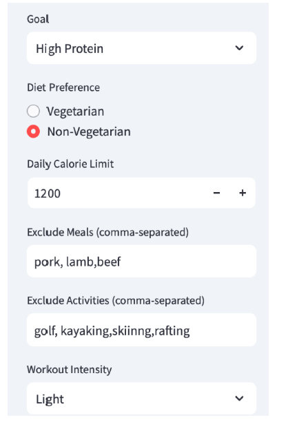
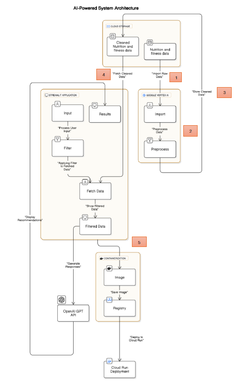
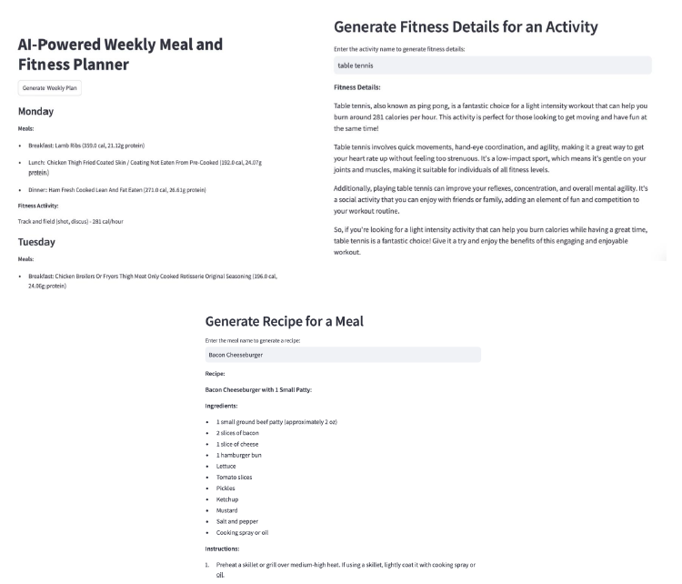

# AI-Enhanced Health & Wellness Application

🚀 **An AI-powered application for personalized meal planning, dietary tracking, and fitness recommendations.**



## 📌 Project Overview
The **AI-Enhanced Health & Wellness Application** aims to revolutionize personal health management by integrating meal planning, dietary tracking, and habit coaching into a user-friendly platform. By leveraging **OpenAI API**, **machine learning models**, and **big data analytics**, this application provides **personalized health recommendations** based on individual user preferences.

## 🎯 Key Features
- **Personalized BMI Calculator** 🏋️‍♂️
- **Meal Recommendations** 🍽️ (Vegetarian & Non-Vegetarian)
- **Fitness Activity Recommendations** 💪 (Light, Moderate, and Intense Workouts)
- **Weekly Meal and Fitness Plan Generator** 📅
- **Integration with OpenAI API for NLP-based suggestions** 🤖
- **Cloud Deployment on Google Vertex AI** ☁️
- **User-friendly UI built with Streamlit** 🎨

---

## 🏗️ AI-Powered System Architecture



## 🛠️ Technology Stack
- **Programming Language:** Python 🐍
- **Frameworks & Libraries:**
  - **Frontend:** Streamlit 🎨
  - **Backend:** Google Cloud Storage (GCS), OpenAI API, Pandas, NumPy, PyTorch
  - **AI & ML:** OpenAI GPT-3.5, Collaborative Filtering, NLP
- **Cloud Services:** Google Cloud Platform (GCP), Vertex AI, Google Cloud Storage
- **Development Tools:** Jupyter Notebook, Google Colab, GitHub

---

## 🔧 Project Setup
### 1️⃣ Clone the Repository
```bash
git clone https://github.com/YOUR_USERNAME/AI-Enhanced-Health-Wellness.git
cd AI-Enhanced-Health-Wellness
```

### 2️⃣ Install Required Dependencies
```bash
pip install -r requirements.txt
```

### 3️⃣ Set Up Google Cloud Storage
- Create a **Google Cloud Storage (GCS) bucket** for datasets.
- Upload datasets (`cleaned_nutrition_data.csv`, `exercise_dataset.csv`) to GCS.
- Ensure authentication with:
```bash
gcloud auth application-default login
```

### 4️⃣ Configure OpenAI API
- Create an account on [OpenAI](https://platform.openai.com/)
- Generate an API key and store it in an environment variable:
```bash
export OPENAI_API_KEY='your_api_key_here'
```

### 5️⃣ Run the Application Locally
```bash
streamlit run app.py
```

---

## 🚀 Deployment
### Deploying on Google Vertex AI
1. **Upload Datasets to GCS:**
   ```bash
   gsutil cp cleaned_nutrition_data.csv gs://your-bucket-name/
   gsutil cp exercise_dataset.csv gs://your-bucket-name/
   ```
2. **Deploy the Streamlit Application Using Vertex AI**
   - Navigate to **Google Vertex AI**
   - Create a new **custom model**
   - Deploy the model with **Jupyter-based Streamlit app**
   - Configure resource allocation and endpoints
   
3. **Access the Application** via the Vertex AI endpoint URL.

---

## 📂 Project Structure
```
📁 AI-Enhanced-Health-Wellness/
│── 📂 data/                     # Contains datasets
│── 📂 models/                   # AI models and saved outputs
│── 📂 notebooks/                # Jupyter notebooks for development
│── 📂 src/                      # Application source code
│── app.py                       # Streamlit frontend
│── requirements.txt             # Dependencies
│── README.md                    # Project documentation
```

---

## 🖥️ Application Output Preview



---

## 📜 License
This project is licensed under the MIT License. See the **LICENSE** file for details.

---

## 🤝 Contributing
Pull requests are welcome! For major changes, please open an issue first to discuss what you would like to change.

---

## 📧 Contact
For any inquiries, reach out via GitHub or email.

---

🚀 **Happy Coding & Stay Healthy!** 🏋️‍♀️🍎💻
